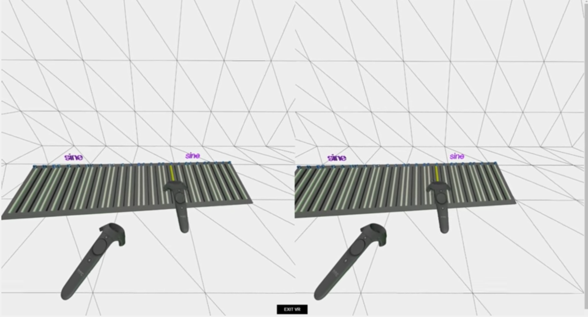

# VR Ondes Martenot

Inspired by the [ondes martenot](https://www.youtube.com/watch?v=v0aflcF0-ys) this is a WebVR based application that attempts to recreate the experience of playing one.

[Here's a video](https://www.youtube.com/watch?v=7IabQXipfS0)

[And here's a hosted demo](https://elifer5000.github.io/vr-ondes-martenot/dist/index.html)  ([emulated version](https://elifer5000.github.io/vr-ondes-martenot/dist/index.html?mode=emu))



## Requirements
* An HTC Vive
* Firefox or Chrome experimental version (get it from [webvr.info](https://webvr.info/get-chrome/))

## Installation
Clone repository and run

```
npm install
```

## Usage
Run webpack dev server

```
npm run server
```

and then point your browser to

```
http://localhost:8080
```

Use the grips to position the keys wherever you desire. It is recommended to put it on top of a real table, that way it can be used as a pivot point and better vibrato can be achieved.

Use the touchpad in the vertical direction for volume control. No sound is produced until the touchpad is touched.

Use the trigger to cycle through the different sounds (Sine, Trapezium, Violin, Square, Triangle, Sawtooth)

Use the menu button to turn delay on/off.


You can test the app without VR by using an emulated mode:

```
http://localhost:8080/?mode=emu
```

This creates two virtual controllers you can move around in the scene to simulate the actual controllers. You can then use these controls:
* Press 1 and 2 to change to move/rotate respectively.
* Press 5 to cycle through the sounds.
* Press 6 to turn delay on/off
* Press spacebar for grip (i.e. position the keys under the control)
